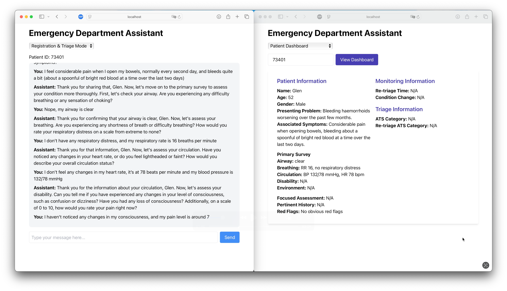

# HEAL: Healthcare Emergency Assistants Leveraging Large Language Models

This repository contains both the backend and frontend components of the HEAL application.


## Demo Video
[](https://youtu.be/qFew6FUd1gU)

## Getting Started

### Backend Setup
1. Navigate to the backend directory:
   ```bash
   cd backend
   ```

2. Start the backend server:
   ```bash
   uvicorn main:app --reload
   ```
   The server will start in development mode with hot-reload enabled.

### Frontend Setup
1. Navigate to the frontend directory:
   ```bash
   cd hospital-llm-app
   ```

2. Start the frontend development server:
   ```bash
   yarn start
   ```
   This will launch the application in your default web browser.

## Project Structure
- `backend/`: Contains the FastAPI backend server
- `hospital-llm-app/`: Contains the frontend application
