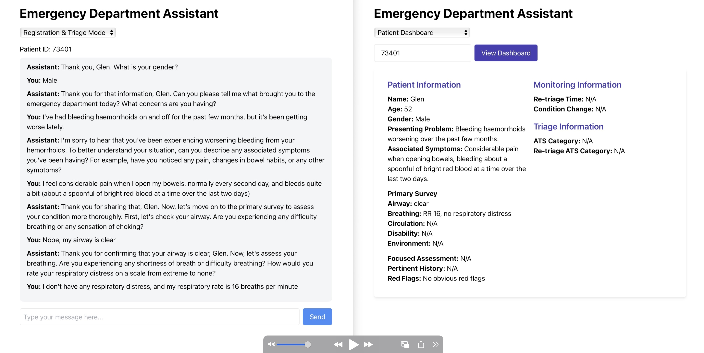

# HEAL: Healthcare Emergency Assistants Leveraging Large Language Models


This repository contains both the backend and frontend components of the HEAL application.

## Demo Video

**Click** below to watch the demo video.

[](https://youtu.be/qFew6FUd1gU)

## Getting Started

### Backend Setup
1. Navigate to the backend directory:
   ```bash
   cd backend
   ```

2. Start the backend server:
   ```bash
   uvicorn main:app --reload
   ```
   The server will start in development mode with hot-reload enabled.

### Frontend Setup
1. Navigate to the frontend directory:
   ```bash
   cd hospital-llm-app
   ```

2. Start the frontend development server:
   ```bash
   yarn start
   ```
   This will launch the application in your default web browser.

## Project Structure
- `backend/`: Contains the FastAPI backend server
- `hospital-llm-app/`: Contains the frontend application

## Reference
If you find it useful, please consider citing our work:

```bibtex
@inproceedings{10.1145/3701716.3715181,
    author = {Zhu, Zihan and Xu, Qiongkai and Beheshti, Amin},
    title = {HEAL: Healthcare Emergency Assistants Leveraging Large Language Models},
    year = {2025},
    url = {https://doi.org/10.1145/3701716.3715181},
    doi = {10.1145/3701716.3715181},
    booktitle = {Companion Proceedings of the ACM on Web Conference 2025},
    pages = {2959–2962}
}
```
